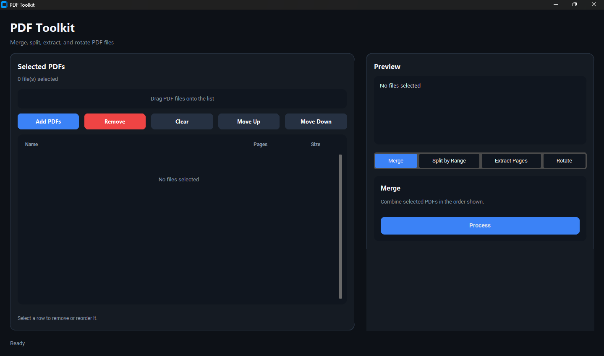
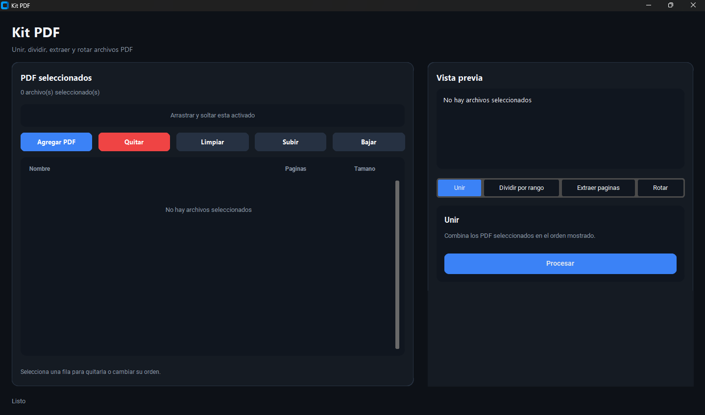

# PDF Toolkit / Kit PDF


## Download

Download the latest portable Windows release:

**[Latest Release](https://github.com/federicoramos67/pdf-toolkit/releases/latest)**

PDF Toolkit / Kit PDF is a portable Windows desktop app for everyday PDF tasks. No installation required: download the executable, open it, select your PDF files, and process them from a modern dark interface.

---

## English

### Overview

PDF Toolkit is a clean, bilingual PDF utility built with Python and CustomTkinter. It provides a focused desktop workflow for merging, splitting, extracting, and rotating PDF files without needing a full PDF editor.

### Features

#### Merge PDFs
Combine multiple PDF files into one output document in the order shown in the selected files list.

#### Split by Range
Create a new PDF from a page range such as `1-3`, `5-8`, or `1-3,7`.

#### Extract Pages
Extract selected pages into a new standalone PDF using flexible page selections.

#### Rotate PDFs
Rotate all pages or selected pages by `90`, `180`, or `270` degrees.

### Usage

1. Download the latest release.
2. Open `PDFToolkit_EN.exe`.
3. Add one or more PDF files.
4. Choose an operation: Merge, Split by Range, Extract Pages, or Rotate.
5. Enter a page range if required.
6. Choose the output location and save the processed PDF.

### Preview



---

## Espanol

### Descripcion

Kit PDF es una utilidad bilingue para Windows creada con Python y CustomTkinter. Ofrece una forma simple y clara de unir, dividir, extraer y rotar archivos PDF sin instalar un editor PDF completo.

### Funciones

#### Unir PDFs
Combina varios archivos PDF en un unico documento de salida, respetando el orden de la lista de archivos seleccionados.

#### Dividir por rango
Crea un nuevo PDF a partir de un rango de paginas como `1-3`, `5-8` o `1-3,7`.

#### Extraer paginas
Extrae paginas seleccionadas en un nuevo PDF independiente usando selecciones flexibles.

#### Rotar PDFs
Rota todas las paginas o paginas seleccionadas en `90`, `180` o `270` grados.

### Uso

1. Descarga la ultima version.
2. Abre `KitPDF_ES.exe`.
3. Agrega uno o mas archivos PDF.
4. Elige una operacion: Unir, Dividir por rango, Extraer paginas o Rotar.
5. Ingresa un rango de paginas si corresponde.
6. Elige la ubicacion de salida y guarda el PDF procesado.

### Vista previa



---

## Project Structure

```text
main.py           English desktop launcher and UI
main_es.py        Spanish desktop launcher
pdf_tools.py      PDF operation layer
utils.py          Shared file, path, and UI helpers
requirements.txt  Python dependencies
build_exe.ps1     Windows build script
README.md         Project documentation
.gitignore        Ignored local and build files
dist/             Built Windows executables
```

## Build Instructions

Install dependencies:

```powershell
python -m venv .venv
.\.venv\Scripts\Activate.ps1
python -m pip install --upgrade pip
pip install -r requirements.txt
```

Build both portable Windows executables:

```powershell
.\build_exe.ps1
```

The build creates:

```text
dist/PDFToolkit_EN.exe
dist/KitPDF_ES.exe
```

## Notes

- Portable Windows app. No installation required.
- Password-protected encrypted PDFs are not supported.
- Drag and drop support is available when the bundled runtime supports it; the file picker is always available.
